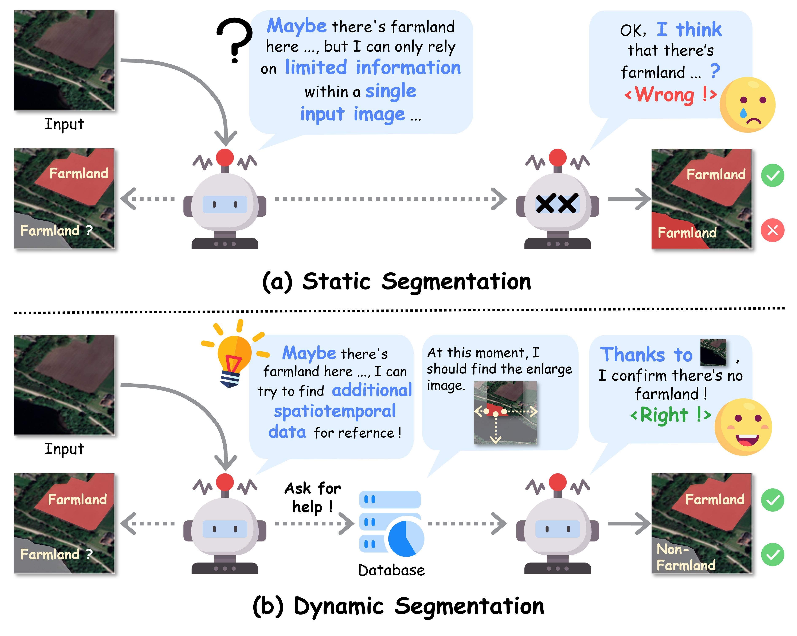

  
  <b>The dataset and code will be released after the paper is accepted!!!</b>

  
  

  <b>Abstract</b> 
  

  Existing methods for farmland remote sensing image (FRSI) segmentation generally follow a static segmentation paradigm, where analysis relies solely on the limited information contained within a single input patch. Consequently, their reasoning capability is limited when dealing with complex scenes characterized by ambiguity and visual uncertainty. In contrast, human experts, when interpreting remote sensing images in such ambiguous cases, tend to actively query auxiliary images (such as higher-resolution, larger-scale, or temporally adjacent data) to conduct cross-verification and achieve more comprehensive reasoning. Inspired by this, we propose a reasoning-query-driven dynamic segmentation framework for FRSIs, named FarmMind. This framework breaks through the limitations of the static segmentation paradigm by introducing a reasoning-query mechanism, which dynamically and on-demand queries external auxiliary images to compensate for the insufficient information in a single input image. Unlike direct queries, this mechanism simulates the thinking process of human experts when faced with segmentation ambiguity: it first analyzes the root causes of segmentation ambiguities through reasoning, and then determines what type of auxiliary image needs to be queried based on this analysis. Extensive experiments demonstrate that FarmMind achieves superior segmentation performance and stronger generalization ability compared with existing methods.  
  

  
  

  
  <a href="https://example.com/demo">Demo</a>
  

  
  

  

  
  

  

  
  

